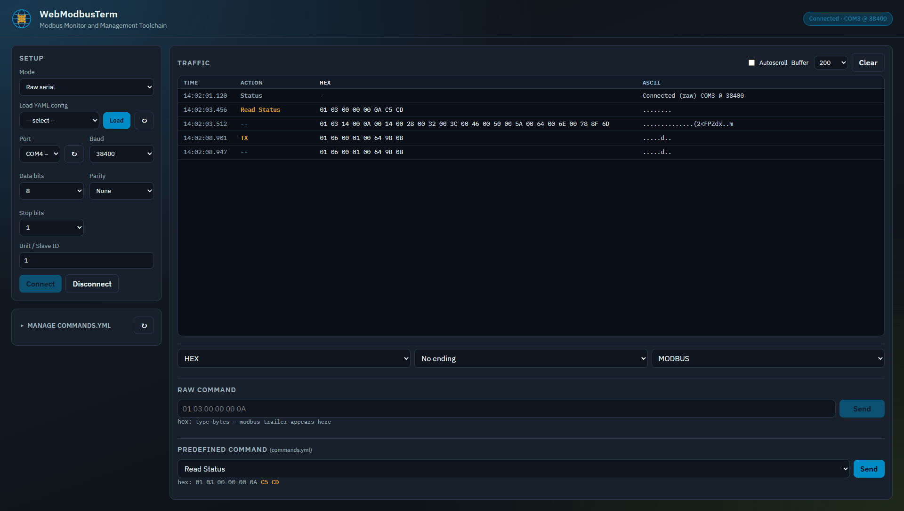

# WebModbusTerm

**Modbus Monitor and Management Toolchain** - a GTKTerm-style serial + Modbus web terminal.

Open: `http://<host>:8088`



_Full-page UI tour: Raw serial → Modbus RTU → Modbus TCP._

## Features

- Mode dropdown: Raw serial / Modbus RTU / Modbus TCP
- Load connection YAML (`webmodbusterm/configs/*.yml`)
- Raw + predefined commands with shared HEX / ending / CRC tools
- CRC modes: MODBUS, N/A, 0x0000, 0x00, 0xFFFF, 0xFF, SUM8, XOR8
- Manage `commands.yml` (CRUD, YAML/CSV import, download)
- Traffic log: Time / Action / HEX / ASCII with buffer size control
- Live WebSocket RX/TX
- Fully offline UI (local fonts, logo, CSS/JS - no CDN)

## Quick start

```bash
python -m venv .venv
# Windows: .venv\Scripts\activate
# Linux:   source .venv/bin/activate
pip install -e .
webmodbusterm
# or: python run.py / python -m webmodbusterm
```

Then open http://127.0.0.1:8088

## Layout

| Path | Role |
|------|------|
| `webmodbusterm/` | Product package (Python, UI, default configs) |
| `deploy/` | systemd unit + portable host install / service CLI |
| `packaging/` | Local `build.sh` / `clean.sh` + nfpm config |
| `docs/` | Demo GIF |

## Local builds

```bash
./packaging/build.sh          # pip + docker
./packaging/build.sh pip      # dist/*.whl + sdist
./packaging/build.sh docker   # webmodbusterm:<version>
./packaging/build.sh nfpm     # dist/*.deb + *.rpm
./packaging/build.sh all
./packaging/clean.sh          # remove dist/, packaging/root/, .venv-build
./packaging/clean.sh docker   # also remove local images
```

`nfpm` staging lives inside `build.sh` (no separate `stage.sh`).

GitHub Actions:

- **CI** (`.github/workflows/build.yml`) — on push/PR: build + smoke-test pip/Docker/nfpm (no publish).
- **Release** (`.github/workflows/release.yml`) — on `v*` tags only: GitHub Release (wheel, `.deb`, `.rpm` + changelog) and push image to GHCR. No PyPI / apt repo.

```bash
# after bumping VERSION + CHANGELOG
git tag v2.0.0
git push origin v2.0.0
# docker pull ghcr.io/<owner>/webmodbusterm:2.0.0
```

## Install options

### pip

```bash
pip install .
# pip install dist/webmodbusterm-*.whl
webmodbusterm --port 8090
```

### Docker

```bash
./packaging/build.sh docker
docker run --rm -p 8088:8088 webmodbusterm
# docker run --rm -p 8088:8088 --device=/dev/ttyUSB0 --group-add dialout webmodbusterm
docker compose up --build
# released images: docker pull ghcr.io/<owner>/webmodbusterm:<version>
```

### Debian / RPM

```bash
./packaging/build.sh nfpm
sudo dpkg -i dist/webmodbusterm_*.deb
# or: sudo rpm -i dist/webmodbusterm-*.rpm
```

### Linux service (venv + systemd)

```bash
sudo bash deploy/install.sh
webmodbusterm status
webmodbusterm logs
webmodbusterm open
```

> Binds `0.0.0.0:8088` with no built-in auth — for LAN / VPN / lab use behind your own access control.

## YAML

**Connection** (`webmodbusterm/configs/modbus-rtu-demo.yml`):

```yaml
name: Modbus Device
connection:
  mode: raw
  port: /dev/ttyUSB0
  baudrate: 38400
  parity: E
```

**Commands** (`webmodbusterm/configs/commands.yml`):

```yaml
commands:
  - id: read_status
    title: Read Status
    value: 01 03 00 00 00 0A
    encoding: hex
```

## Notes

- Version: **2.0.0** (`VERSION`, `CHANGELOG.md`)
- HEX mode accepts only `0-9 A-F` and spaces
- Modbus logo attribution / trademark notes: see `NOTICE`
